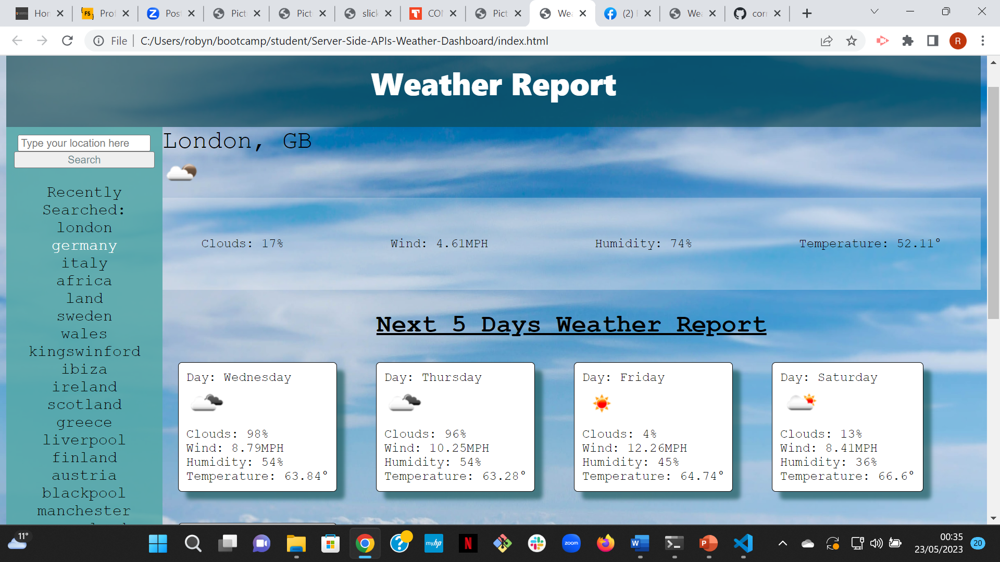

# Server-Side-APIs-Weather-Dashboard

## Description
The Weather Dashboard webpage has been created to support traveler's effectively plan their trips. This application has been created using html, JavaScript, CSS and API's. API stands for Application Programming Interface, and allows sharing of data, in this case api's were used to request data about the weather. The desired data was then chosen and displayed on the webpage using JavaScript. When a user opens the page they are presented with a header, aside, main, article, section, h1, h2, an input area (search bar) and button html elements. They will also see place holder text. When the user types a location in the search bar and clicks the search button below, they will see the name of the city, current temperature, wind speed, humidity level and percentage of clouds in that location. An icon will also appear clearly displaying the type of weather so that it is much easier for readers to see and is more inclusive for those who struggle with reading. All of this data is retrived using a weather API.

Additionally, the user will also be presented with a 5 day forecast of that location so they are aware of what the next 5 days of weather will be and therefore they can use this information to plan activitys in advance. These 5 days also display the day of the week and forecast also including the current temperature, wind speed, humidity level, percentage of clouds in that location and an icon to summarise this. If a user does not type anything before clicking the search button a message will appear for 2 seconds encouraging the user to enter a valid location. 

Futhermore, this website also stores recent location searches in the search history with the use of local storage. This allows the user to view their recently searched locations and the ability to click these and view the weather for that location again. This improves the user experience as it allows users to quickly view the weather in places where they are living or visit regularly. 

This page is also very eye catching and visually appealing to the user. With the use of CSS code, the page is also responsive and adapts to smaller screen sizes so that users can view from different devices. As seen in the image below a sky background was used with blue tones, asthetically pleasing font, changes of hover styling, shadows and boxes to improve the layout of the page.

## Usage
This page is very simple to use. The user simply enters their disired location into the search bar and clicks the button this activates the on click event handler and retrives weather information from the api and displays it for the user to see. After this, the user can refresh their page to see their searches in the recently searched section of the aside. The user then can select a recently searched location to view the according weather information again.

Link to deployed GitHub Pages:
